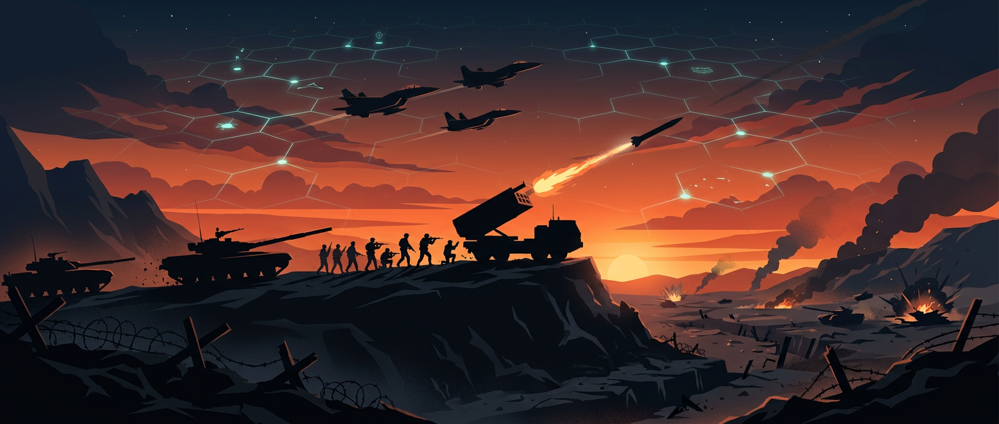

<div align="center">



# ⚔️ نبردگاه — ربات تلگرامی جنگ و رقابت نظامی

یک ربات تلگرام چندکاربره با **Python** — کاربران با هم رقابت می‌کنند، ارتش می‌سازند و به پایگاه هم حمله می‌کنند!

</div>

---

## ✨ امکانات بازی

| بخش | توضیح |
|---|---|
| 🪖 **یگان‌ها** | ۹ یگان: سرباز، تکاور، تانک، بالگرد جنگی، جنگنده، موشک بالستیک، پهپاد، ناو جنگی، بمب‌افکن |
| 🛡 **دفاعیات** | ۴ سازه: دیوار دفاعی، قلعه، برج پدافندی، سامانه رادار |
| 💥 **نبرد PvP** | حمله با ریپلای، یوزرنیم یا به‌صورت تصادفی (`/attack random` و `/war`) |
| 🎲 **شبیه‌سازی نبرد** | قدرت حمله/دفاع، شانس، تلفات واقعی یگان‌ها، غنیمت سکه، تجربه |
| ⚡ **انرژی** | هر حمله ۳۰ انرژی؛ هر ۴ دقیقه ۱ واحد بازتولید می‌شود |
| 🕊 **سپر** | محافظت ۶ یا ۲۴ ساعته در برابر حمله‌ها |
| 🎁 **جایزه روزانه** | سکهٔ روزانه که با سطح بالا می‌رود |
| 🏆 **رده‌بندی** | قدرتمندترین و ثروتمندترین فرماندهان |
| 🎖 **درجه‌ها** | از سرباز تا ژنرال با ارتقای سطح |
| 📜 **تاریخچه** | گزارش کامل نبردهای اخیر و اعلان حمله به مدافع |
| 🏰 **اتحادیه‌ها** | ساخت اتحادیه، خزانهٔ مشترک، اعضا، رهبر، جنگ ۲۴ ساعته بین اتحادیه‌ها با امتیاز و غنیمت ۲۵٪ خزانه |
| ⛏ **استخراج منابع** | فرستادن سربازها به معدن (۳ سکه در ساعت، سقف ۸ ساعت) |
| 🎯 **مأموریت‌های روزانه** | ۶ مأموریت (حمله، پیروزی، خرید، خرج، معدن، واریز) با جایزهٔ سکه و تجربه |
| 📈 **نمودار رشد** | نمودار خطی رشد قدرت هر بازیکن (با فونت فارسی Vazirmatn) |

## 🚀 راه‌اندازی در ۴ قدم

### ۱) پیش‌نیاز
پایتون ۳.۱۰ یا بالاتر.

### ۲) نصب کتابخانه‌ها
```bash
pip install -r narbad_bot/requirements.txt
```

### ۳) دریافت توکن از BotFather
در تلگرام به [@BotFather](https://t.me/BotFather) پیام بده:
1. `/newbot` → یک نام بده (مثلاً `نبردگاه`)
2. توکنی شبیه `123456789:AAH...` می‌گیری
3. برای دستورهای منوی ربات: `/setcommands`

سپس در پوشهٔ پروژه فایل `.env` بساز:
```env
BOT_TOKEN=123456789:AAH...توکن-تو
```
(نمونه: `narbad_bot/.env.example`)

### ۴) اجرا
```bash
python -m narbad_bot.bot
```
تمام! ربات بالا آمد و می‌توانی در چت ربات بازی را شروع کنی.

> 🧪 بدون توکن هم می‌توانی نبرد را ببینی:
> ```bash
> python simulate.py   # شبیه‌ساز نبرد در ترمینال
> python -m unittest discover -s tests   # ۲۰ تست خودکار
> ```

## 🎮 منوی شیشه‌ای پایین چت — ساختار جدید (۵ دسته)

همه قابلیت‌های عادی بازی **فقط با دکمه‌ها** قابل بازی هستند — بدون تایپ! با `/menu` یا `/start` صفحه‌کلید سفارشی پایین چت (ReplyKeyboard) باز می‌شود (صفحه‌کلید واقعی تلگرام، نه وب) و همیشه پایین چت می‌ماند:

```
[ 🏠 پایگاه ]  [ 🪖 ارتش ]  [ 🛡 دفاع ]
[ ⚔️ نبرد   ]  [ 🏰 اتحادیه]  
```

### ناوبری
- پایین چت = **دسته‌های اصلی** (همیشه قابل مشاهده، ۲ ردیف: بالا ۳تایی، پایین ۲تایی)
- داخل هر دسته = **زیرمنوی Inline شیشه‌ای** (تیرهٔ نظامی + درخشش نئون)
- هر زیرمنو دارای **⬅️ بازگشت** (به دستهٔ والد) و **🏠 منوی اصلی** (بستن پنل) است — مثال: ارتش → آموزش یگان‌ها → بازگشت به ارتش
- بعد از هر عملیات (خرید، دریافت جایزه، ...) منو باز می‌ماند و با همان دکمه‌های ناوبری ادامه می‌دهی (بسته نمی‌شود)

| دسته | زیرمنوها |
|---|---|
| 🏠 **پایگاه** | 👤 پروفایل (آمار/درجه/قدرت/سطح)، 🎁 جایزه روزانه، 🎯 مأموریت‌ها، ⛏ معدن، 📈 نمودار رشد، 🏆 رده‌بندی، 📜 تاریخچه نبردها، 🛡️ سپر محافظتی |
| 🪖 **ارتش** | 🎓 آموزش یگان‌ها (۹ یگان: سرباز/تکاور/تانک/بالگرد/جنگنده/موشک/پهپاد/ناو/بمب‌افکن)، 🗃️ ارتش من، ⬆️ ارتقای یگان |
| 🛡 **دفاع** | 🧱 خرید سازه‌ها (دیوار/قلعه/برج/رادار)، ⬆️ ارتقای دفاع، 🛡️ سپر |
| ⚔️ **نبرد** | 🎲 نبرد تصادفی، 🎯 منوی حمله، 📜 تاریخچه، 📊 اطلاعات نبرد |
| 🏰 **اتحادیه** | 🏰 اتحادیه من، 📋 لیست اتحادیه‌ها، ⚔️ جنگ / وضعیت جنگ، 💰 خزانه |

- دکمه‌ها **Persistent** هستند و همیشه پایین چت می‌مانند
- با `/hidemenu` پنهان و با `/menu` دوباره ظاهر می‌شوند
- فقط دستورات خاص **نیازمند ورودی کاربر** به صورت دستوری باقی مانده‌اند (بقیه همه داخل منو هستند)

> 🖼 پیش‌نمایش طراحی (گلسمورفیسم + تم تیرهٔ نظامی + درخشش نئون):
> `assets/menu_preview.png` — ساخته‌شده با `python make_mockup.py`

## 📜 دستورات ربات — فقط موارد خاص

> **اصل طراحی:** همه قابلیت‌های عادی بازی داخل منوی دکمه‌ای هستند. فقط دستوراتی که «ورودی کاربر» نیاز دارند یا برای دستور مستقیم مناسب‌ترند به صورت دستوری باقی مانده‌اند.

| دستور | کار |
|---|---|
| `/start` | شروع بازی و نمایش منوی اصلی (۸۰۰ سکه + ۵ سرباز هدیه 🎁) |
| `/menu` | نمایش منوی اصلی 🎮 |
| `/hidemenu` | پنهان‌کردن منو 🚫 |
| `/attack @user` | حمله مستقیم به بازیکن — ریپلای، یوزرنیم، آیدی یا `random` برای حریف تصادفی 💥 |
| `/gift @user مقدار` | هدیه سکه به بازیکن دیگر (مثال: `/gift @ali 500`) 🎁 |
| `/admin` | 👑 پنل مدیریت — فقط برای توسعه‌دهندگان |
| `/myid` | نمایش شناسهٔ عددی شما 🆔 |

> 💡 **بقیه قابلیت‌ها همه داخل منوی دکمه‌ای هستند** — برای پروفایل، آموزش یگان، دفاع، نبرد، اتحادیه، معدن، مأموریت، نمودار و رده‌بندی فقط از دکمه‌های پایین چت استفاده کن؛ نیازی به تایپ دستور نیست. دستور `/help` همچنان راهنمای کامل را نشان می‌دهد.

## 💡 نمونهٔ یک نبرد

```
🏆 پیروزی در نبرد!
🔻 حریف: علی
────────────────
⚔️ قدرت حملهٔ تو: ۱٬۲۴۰
🛡 قدرت دفاع حریف: ۸۹۰
💥 تلفات تو: 🪖×۳
💥 تلفات حریف: 🛡️×۱، 🚀×۱
────────────────
💰 غنیمت: ۲٬۴۶۰ سکه
⭐ تجربه: +۶۰
🎉 ارتقا سطح! سطح ۴ + ۳۵۰💰 جایزه
```

## ⚙️ معماری پروژه

```
narbad_bot/
├── bot.py                   # ورودی اصلی، اتصال به تلگرام، ثبت دستورها
├── config.py                # خواندن تنظیمات از .env
├── admins.py                # 🔐 شناسه‌های مدیران/تست‌کننده‌ها (پیکربندی)
├── admin_core.py            # 🛠 هستهٔ اختیارات داینامیک (سکه/انرژی/تجربه...)
├── admin_panel.py           # 👑 پنل /admin (فقط برای مدیران)
├── db.py                    # SQLite: کاربران، ارتش، اتحادیه، نبرد...
├── game.py                  # منطق بازی: یگان‌ها، فرمول‌ها، مأموریت‌ها، آیتم‌ها
├── hooks.py                 # اتصال رویدادها به مأموریت/جنگ اتحادیه/رشد
├── handlers.py              # دستورات اصلی (نبرد، پروفایل، ...)
├── handlers_missions.py     # مأموریت‌های روزانه و معدن
├── handlers_clan.py         # اتحادیه‌ها و جنگ بین اتحادیه‌ها
├── menu.py                  # 🎮 منوی شیشه‌ای پایین چت (صفحه‌کلید سفارشی)
├── charts.py                # نمودارهای matplotlib با فونت فارسی
├── requirements.txt / .env.example / pyproject.toml
└── assets/                  # بنر، فونت Vazirmatn، ایموجی‌ها، پیش‌نمایش‌ها
```

> 🖼 ساخت مجدد پیش‌نمایش منو: `python make_mockup.py` (خروجی در `assets/menu_preview.png`)

### نکته‌های فنی
- **aiogram 3.x** — فریمورک مدرن و async تلگرام
- **SQLite + aiosqlite** — ذخیره‌سازی سبک بدون نیاز به سرور دیتابیس؛ با مهاجرت خودکار از نسخه‌های قدیمی دیتابیس
- **HTML parse mode** — قالب‌بندی پیام‌ها (متن کاربران escape می‌شود)
- **matplotlib + arabic-reshaper + python-bidi + Vazirmatn** — نمودارهای فارسی و راست‌به‌چپ
- **درآمد غیرفعال (Idle)** — معدن سربازها به‌مرور سکه تولید می‌کند؛ گیم‌پلی بدون نیاز به آنلاین بودن
- حکم‌های زمانی (سپر، بافت‌ها، جنگ اتحادیه) با timestamp بررسی می‌شوند؛ نیازی به Cron نیست
- محدودیت‌های اسپم: کول‌داون ۹۰ ثانیه‌ای حمله به یک حریف

### نکته‌های فنی
- **aiogram 3.x** — فریمورک مدرن و async تلگرام
- **SQLite + aiosqlite** — ذخیره‌سازی سبک بدون نیاز به سرور دیتابیس
- **HTML parse mode** — قالب‌بندی پیام‌ها (متن کاربران escape می‌شود)
- ارتش‌ها به‌صورت `(کاربر، یگان)` در جدول `army` ذخیره می‌شوند و با هر نبرد، تلفات واقعی کم می‌شود

## 🔐 سیستم مدیران و تست (Developer / Tester)

### افزودن شناسهٔ خود
شناسهٔ عددی‌ات را از **@userinfobot** یا با دستور `/myid` در ربات بگیر و در
`narbad_bot/admins.py` بگذار:

```python
DEVELOPER_IDS = [123456789]   # مدیران کل
TESTER_IDS    = [987654321]   # تست‌کننده‌ها
```

سپس ربات را ری‌استارت کن. (راهنمای کامل با کامنت داخل فایل است.)

### 👑 مدیران (Developer)
- سکه، انرژی، سطح و تجربه **نامحدود** (نمایش «∞» — بدون ذخیرهٔ مقدار بی‌نهایت در دیتابیس)
- خرید همهٔ یگان‌ها، سازه‌ها و آیتم‌ها **رایگان**
- بدون کول‌داون حمله
- دسترسی به **/admin** (پنل کامل مدیریت)

### 🧪 تست‌کننده‌ها (Tester)
- در اولین ورود: **۱۰۰٬۰۰۰ سکه + ۲۰٬۰۰۰ تجربه + یگان‌های کامل + آیتم‌ها** (یک‌بار، مقادیر واقعی)
- تجربهٔ **×۲** (پیشرفت سریع) و بدون کول‌داون حمله
- بدون سکهٔ بی‌نهایت و بدون دسترسی به /admin

### 🛠 پنل /admin (فقط مدیران)
افزودن سکه/تجربه، تغییر سطح، دادن یگان و آیتم، **نبرد آزمایشی** (فقط شبیه‌سازی و هیچ تغییری در دیتابیس)،
اطلاعات بازیکن و **ریست حساب تست** (برگرداندن کامل به حالت اولیه + تمدید هدیهٔ تست).
نمونه: `/admin` → «💵 افزودن سکه» → `123456789 50000`

### ⚙️ اصول طراحی
- همهٔ اختیارات **داینامیک** و در لحظه بررسی می‌شوند (`admin_core`)؛ هیچ مقدار بی‌نهایتی ذخیره نمی‌شود
- جداسازی کامل: `admins.py` (پیکربندی) / `admin_core.py` (هستهٔ اختیارات) / `admin_panel.py` (UI)
- بازیکنان عادی هیچ تفاوتی حس نمی‌کنند
- سیستم‌های قبلی (حمله، جنگ، مأموریت، اتحادیه، اقتصاد) دست‌نخورده‌اند

## 🎮 ایده‌های توسعهٔ بعدی
- 🏟 مسابقات هفتگی با جایزهٔ بزرگ
- 🤖 مأموریت‌های داستانی در برابر BOTهای NPC
- 📱 وب‌ویو برای نقشهٔ تعاملی زنده
- 🧬 درخت فناوری (Tech Tree) برای آزادسازی یگان‌های جدید
- 💬 سیستم اعلان‌های کانال اتحادیه

---

> 🖼 نمونهٔ نمودار رشد تولیدشده در `assets/preview_growth.png`
> و نمودار مقایسهٔ اتحادیه‌ها در `assets/preview_clans.png`
ساخته‌شده با ❤️ برای دوستداران بازی‌های جنگی — موفق باشید، ژنرال! 🎖
